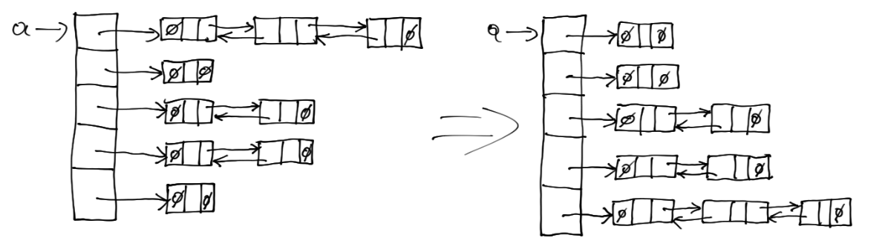
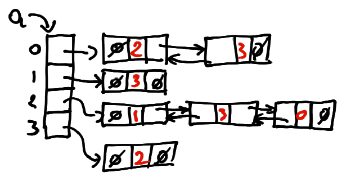

# Esercitazione 10 - 20/12/2024

### Esercizio
Scrivere una funzione in C che riceve in input una lista concatenata `a` con `n`
nodi contenenti `float` ed aggiunge in fondo a questa `n+1` nodi con valore `0`.

La funzione da progettare deve avere il seguente prototipo
```c
lista ListaRaddoppia(lista a);
```
dove `a` è la lista in input. La funzione restituisce la lista modificata.

La lista concatenata è definita nel seguente modo:
```c
typedef struct nodo {
    float dato;
    struct nodo *succ, *prec;
} nodo;

typedef nodo *lista;
```

### Esercizio
Scrivere una funzione in C che riceve in input una lista concatenata `a` con `n`
nodi contenenti `float` e restituisce il puntatore al nodo **mediano**: se la
lista contiene `n` nodi, il nodo mediano è quello in posizione parte intera di
`n/2`.

La funzione da progettare deve avere il seguente prototipo
```c
nodo *ListaMediano(lista a);
```
dove `a` è la lista in input. La funzione restituisce il puntatore al nodo
mediano. 

La lista concatenata è definita nel seguente modo:
```c
typedef struct nodo {
    float dato;
    struct nodo *succ, *prec;
} nodo;

typedef nodo *lista;
```

*Suggerimento: la soluzione migliore dovrebbe scandire la lista al più una
volta*

### Esercizio
Scrivere una funzione in C che riceve in input:

- una lista concatenata `a` con `n` nodi contenenti `float`;
- un puntatore `x` ad uno dei suoi nodi;

e **scambia** la posizione di `x` con il nodo successivo.

La funzione da progettare deve avere il seguente prototipo
```c
lista ListaScambiaNodiCons(lista a, nodo *x);
```
dove `a` è la lista in input e `x` è il primo dei due nodi consecutivi che devono
essere scambiati. La funzione restituisce la lista modificata. 

La lista concatenata è definita nel seguente modo:
```c
typedef struct nodo {
    float dato;
    struct nodo *succ, *prec;
} nodo;

typedef nodo *lista;
```

### Esercizio
Scrivere una funzione in C, che data una lista in input `a` con `n` nodi
contenenti `float`, **estrapoli** la sotto-lista delimitata da due nodi
individuati attraverso i loro campi `dato`.

La funzione da progettare deve avere il seguente prototipo
```c
lista EstraiSegmento(lista a, float k1, float k2);
```
dove `a` è la lista in input e `k1` e `k2` sono le i due float utilizzati per
descivere la sottolista di `a` da estrarre. La funzione deve restituire la
sottolista di `a` composta dai nodi compresi tra il primo nodo `n1` contenente
il float `k1` ed il primo nodo `n2` contenente il float `k2`. Il nodo `n2`
**non** deve precedere `n1`. I nodi estremi sono compresi, ovvero `n1` e `n2`
devono far parte della sotto-lista di output. Tutti gli altri nodi di `a` non
compresi nella nuova lista devono essere eliminati. Se uno dei due nodi (`n1` o
`n2`) non esiste deve essere restituita la lista iniziale non modificata.

La lista concatenata è definita nel seguente modo:
```c
typedef struct nodo {
    float dato;
    struct nodo *succ, *prec;
} nodo;

typedef nodo *lista;
```

### Esercizio
Scrivere una funzione in C, che data una lista in input `a` con `n` nodi
contenenti `float`, **elimina** tutti i nodi di una lista contenenti un dato
`float`.

La funzione da progettare deve avere il seguente prototipo
```c
lista CancellaTutto(lista a, float k);
```
dove `a` è la lista in input da cui bisogna eliminare tutti i nodi che
contengono, nel campo `dato`, un `float` uguale a `k`. La funzione restituisce
la lista modificata.

La lista concatenata è definita nel seguente modo:
```c
typedef struct nodo {
    float dato;
    struct nodo *succ, *prec;
} nodo;

typedef nodo *lista;
```

### Esercizio
Scrivere una funzione in C, che data una lista in input `a` con `n` nodi
contenenti `float`, **inverte** l'ordine dei nodi.

La funzione da progettare deve avere il seguente prototipo
```c
lista InvertiLista(lista a);
```
dove `a` è la lista in input. La funzione restituisce la lista modificata.

La lista concatenata è definita nel seguente modo:
```c
typedef struct nodo {
    float dato;
    struct nodo *succ, *prec;
} nodo;

typedef nodo *lista;
```

### Esercizio
Scrivere una funzione in C che, date due liste in input `a` e `b` contenenti
`float` tali che `a` è ordinata in modo *crescente* e `b` è ordinata in modo
*decrescente*, **ordina** in modo *crescente* gli elementi di `a` e `b` in
un'unica lista.

La funzione da progettare deve avere il seguente prototipo
```c
lista MergeInv(lista a, lista b);
```
dove `a` e `b` sono le liste in input ordinate in modo crescente (`a`) e in modo
decrescente (`b`). La funzione restituisce la lista composta dai nodi delle lista
`a` e `b`, ovvero non è permesso creare nuovi nodi.

La lista concatenata è definita nel seguente modo:
```c
typedef struct nodo {
    float dato;
    struct nodo *succ, *prec;
} nodo;

typedef nodo *lista;
```

### Esercizio
Scrivere una funzione in C che acquisisce l'input da terminale e termina non
appena l'utente digita una stringa che non rappresenta un intero. Durante il
processo di acquisizione ogni intero digitato deve essere inserito in fondo ad
una lista inizialmente vuota. La funzione deve restituire la lista creata.

La funzione da progettare deve avere il seguente prototipo
```c
lista InputList();
```
ovvero la funzione non ha input e restituisce il puntatore alla lista generata
(se nessun nodo viene scritto in input, la funzione deve ritornare `NULL`).

La lista concatenata è definita nel seguente modo:
```c
typedef struct nodo {
    int dato;
    struct nodo *succ, *prec;
} nodo;

typedef nodo *lista;
```

### Esercizio
Scrivere una funzione in C che riceve in input un array `a` di liste concatenate e
le ordina per lunghezze crescenti.



In figura è mostrato un array di liste prima e dopo essere stato ordinato dalla
funzione.

La funzione da progettare deve avere il seguente prototipo
```c
void ArrayListeSort(lista a[], int n);
```
dove `a` è l'array di liste in input e `n` la sua dimensione.

La lista concatenata è definita nel seguente modo:
```c
typedef struct nodo {
    float dato;
    struct nodo *succ, *prec;
} nodo;

typedef nodo *lista;
```

### Esercizio
Scrivere una funzione in C che riceve in input:

- un array `a` di liste concatenate, dove gli elementi di ogni lista sono interi
in $\{0,1,\dots,n-1\}$;
- un array `I` binario, cioè contenente solo valori in $\{0,1\}$;

e restituisce in output `0` o `1` secondo la regola seguente

$$
\texttt{indset}(a,I,n) = \begin{cases}
1 \ \ &\text{se per ogni } x \text{ tale che } I[x] = 1 \text{ e per ogni } y
\text{ in } a[x], I[y] = 0 \\
0 \ \ &\text{altrimenti}
\end{cases}
$$

La funzione da progettare deve avere il seguente prototipo
```c
void ind_set(lista a[], int I[], int n);
```
dove `a` è l'array di liste in input, `I` è l'array binario ed
`n` la loro dimensione.

La lista concatenata è definita nel seguente modo:
```c
typedef struct nodo {
    int dato;
    struct nodo *succ, *prec;
} nodo;

typedef nodo *lista;
```

Esempio: sia `a` l'array di `n=4` liste rappresentato in figura



con `I={1,1,0,0}` la funzione deve restituire `1` mentre con `I={1,0,0,1}` la
funzione deve restituire `0` perché `3` è in `a[0]`.
